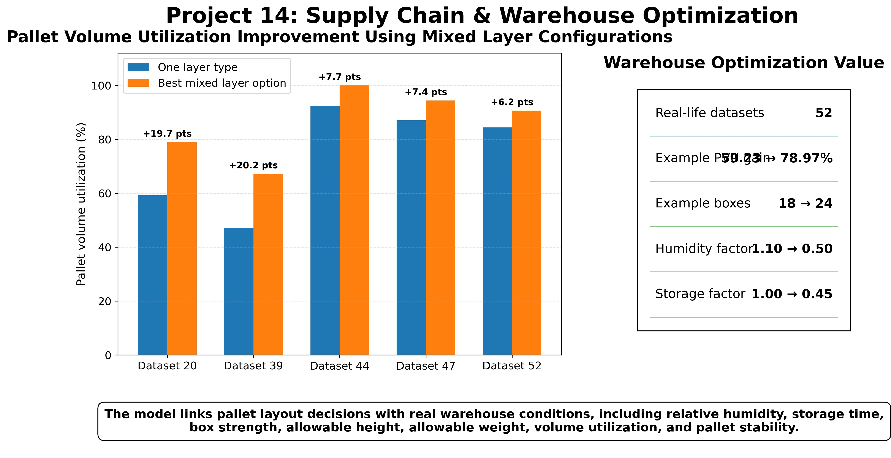
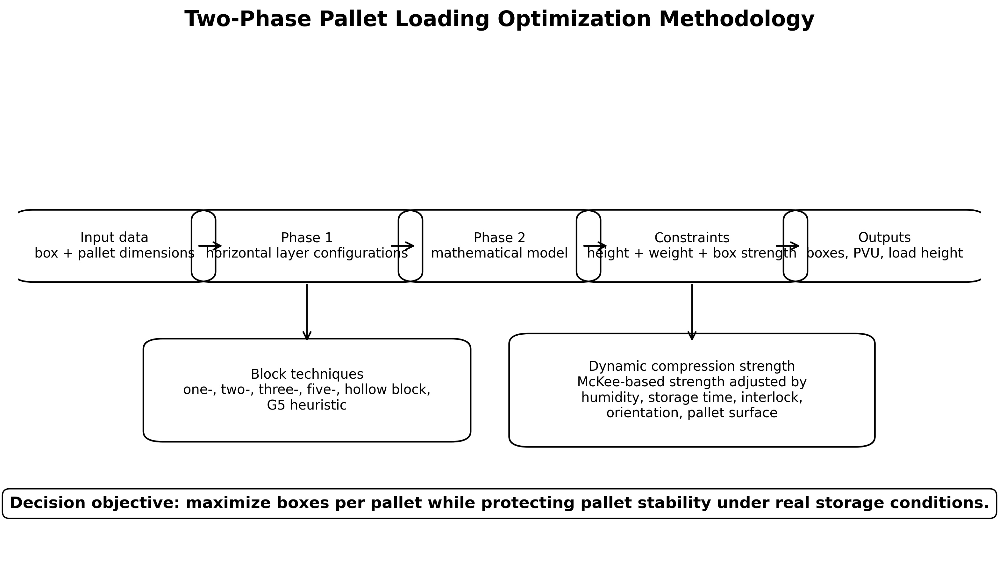
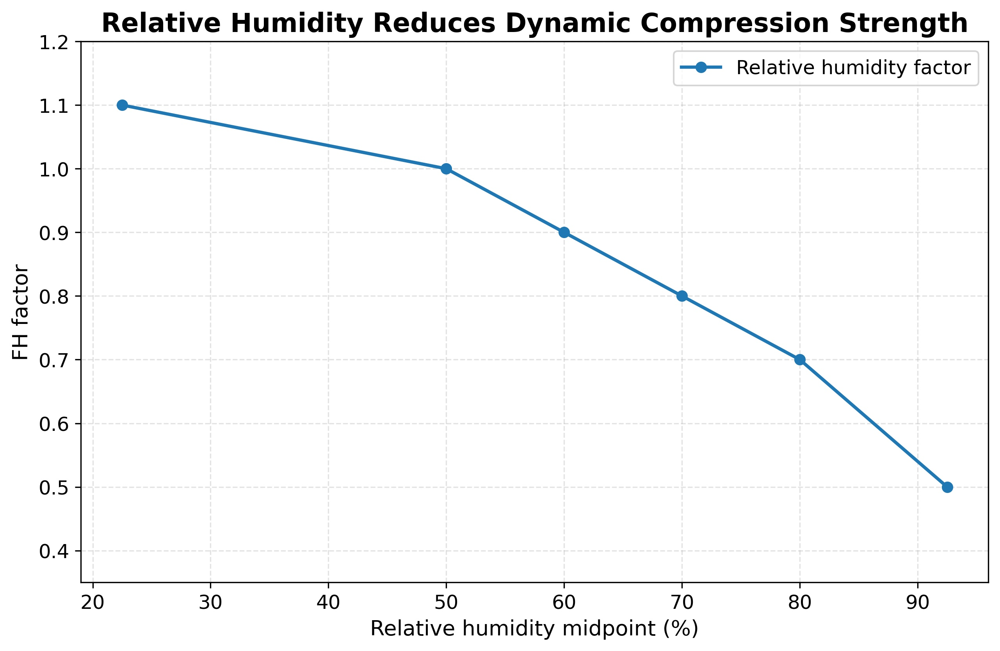
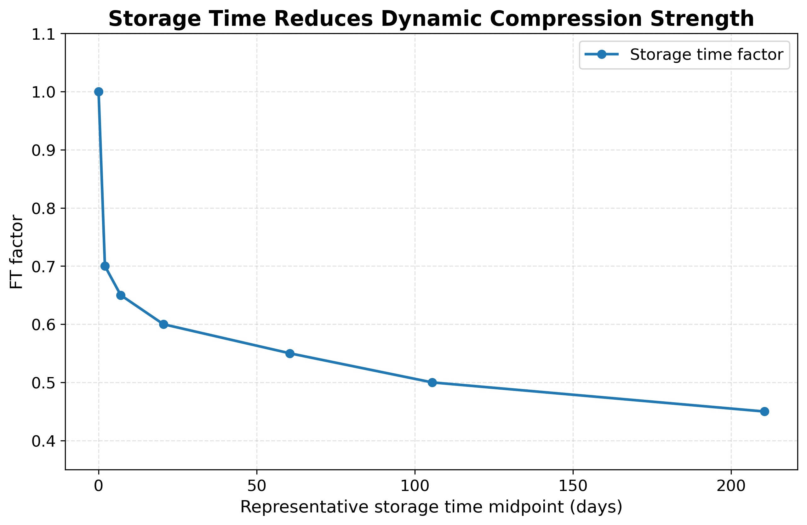
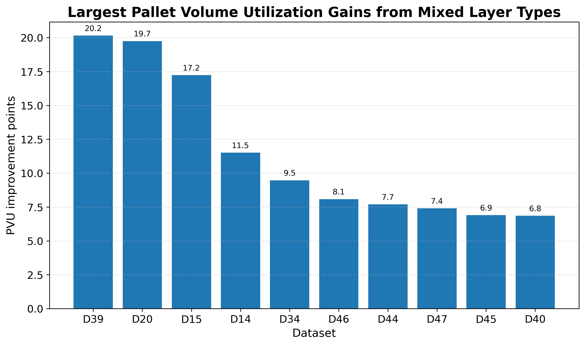
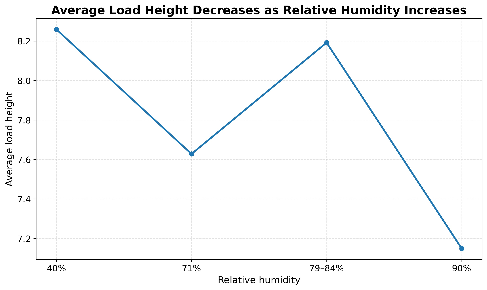
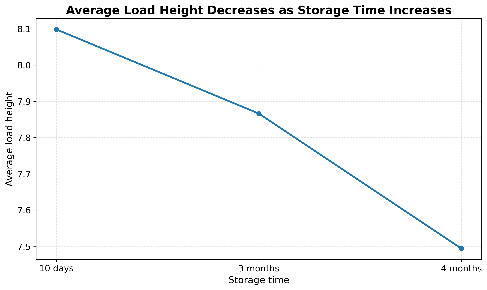

# Supply Chain & Warehouse Optimization: Pallet Loading Under Storage Time and Relative Humidity

## Project overview

This repository presents a supply chain and warehouse optimization case study based on the published paper:

**Almasarwah, N., Abdelall, E., Suer, G., Egilmez, G., Singh, M., & Ramadan, S. (2023). Pallet loading optimization considering storage time and relative humidity. Journal of Industrial Engineering and Management, 16(2), 453–471. https://doi.org/10.3926/jiem.4613**

The project demonstrates how pallet loading decisions can be optimized by considering not only pallet dimensions and box dimensions, but also real warehouse conditions such as **relative humidity**, **storage time**, **interlock stacking**, and **dynamic compression strength**.



## Business problem

Pallet loading directly affects warehouse utilization, transportation efficiency, product damage risk, and customer satisfaction. Traditional pallet loading models usually focus on geometric fit and volume utilization, but real supply chain environments also affect box strength and pallet stability.

The business question addressed in this project is:

> How can warehouses improve pallet volume utilization while maintaining safe pallet stability under changing humidity and storage-time conditions?

## Proposed solution

The paper proposes a two-phase heuristic algorithm:

1. **Phase 1: Horizontal layer configuration**
   - Determine the number of boxes per horizontal layer.
   - Use block techniques to create layer configurations based on which box dimension is perpendicular to the pallet base.

2. **Phase 2: Maximum number of boxes per pallet**
   - Use a mathematical model to maximize the number of boxes per pallet.
   - Consider maximum allowable height, maximum allowable weight, and dynamic compression strength.



## Key operational factors

The dynamic compression strength of boxes is adjusted using:

- Relative humidity factor
- Storage-time factor
- Interlock stacking factor
- Pallet-surface factor
- Box orientation factor





## Case study

The proposed approach was tested using **52 real-life datasets from DHL Supply Chain**. The paper evaluates:

- Pallet volume utilization
- Load height
- Pallet stability
- Effect of humidity
- Effect of storage time
- Effect of mixed horizontal layer types

## Selected results

For one illustrative dataset from the paper:

| Metric | One layer type | Mixed layer option |
|---|---:|---:|
| Number of boxes per pallet | 18 | 24 |
| Pallet volume utilization | 59.23% | 78.97% |

This shows how mixed horizontal layer configurations can improve pallet utilization while respecting operational constraints.



## Stability insights

The paper shows that:

- Dynamic compression strength decreases as relative humidity increases.
- Dynamic compression strength decreases as storage time increases.
- Interlock stacking can improve pallet stability, but it can reduce dynamic box strength.
- The best loading plan must balance pallet utilization and load stability.





## Repository contents

```text
pallet_loading_warehouse_optimization/
│
├── README.md
├── CITATION.cff
├── requirements.txt
│
├── docs/
│   ├── executive_summary.md
│   ├── methodology.md
│   ├── business_impact.md
│   └── limitations_and_future_work.md
│
├── figures/
│   ├── project14_pallet_loading_optimization_summary.jpg
│   ├── 01_two_phase_methodology.jpg
│   ├── 02_storage_time_strength_factor.jpg
│   ├── 03_relative_humidity_strength_factor.jpg
│   ├── 04_pvu_gain_from_mixed_layers.jpg
│   ├── 05_relative_humidity_vs_load_height.jpg
│   ├── 06_storage_time_vs_load_height.jpg
│   └── 07_stacking_pattern_tradeoff.jpg
│
├── data/
│   ├── storage_time_factors.csv
│   ├── relative_humidity_factors.csv
│   ├── other_dynamic_strength_factors.csv
│   ├── selected_pvu_examples.csv
│   ├── selected_humidity_impact_examples.csv
│   ├── selected_storage_time_impact_examples.csv
│   └── case_study_summary.csv
│
└── notebooks/
    └── pallet_loading_optimization_demo.ipynb
```

## Consulting value

This project is relevant to:

- Warehouse operations
- Supply chain optimization
- Logistics planning
- Packaging and palletization
- Storage policy design
- Distribution center performance improvement

## Disclaimer

This repository is prepared for educational, research, and portfolio demonstration purposes. The included datasets are summary/demo files based on values reported in the published paper.
